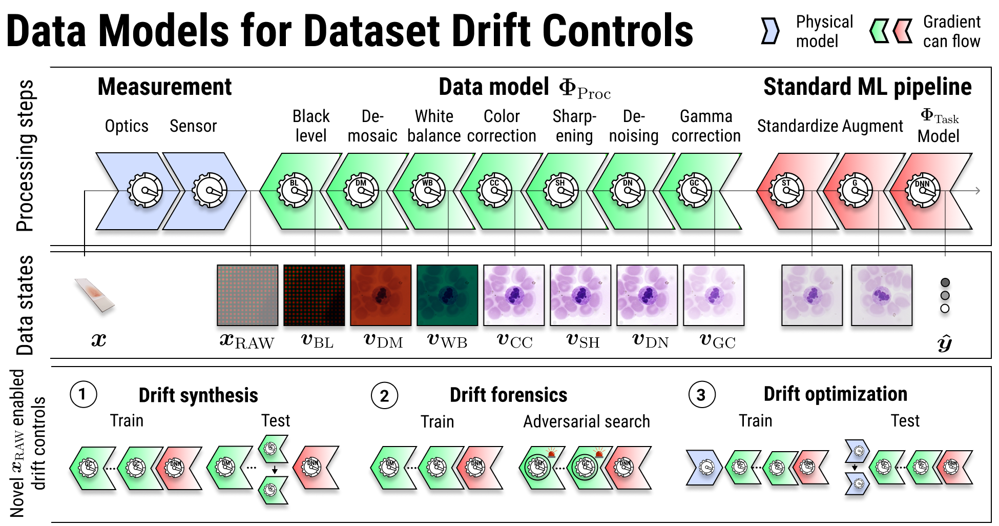

[](https://doi.org/10.5281/zenodo.5235536)

# Data Models for Dataset Drift Controls in Machine Learning With Images
**[Paper](https://arxiv.org/abs/2211.02578) | [Data](https://doi.org/10.5281/zenodo.5235536)**

     @misc{https://doi.org/10.48550/arxiv.2211.02578,
      doi = {10.48550/ARXIV.2211.02578},
      url = {https://arxiv.org/abs/2211.02578},
      author = {Oala, Luis and Aversa, Marco and Nobis, Gabriel and Willis, Kurt and Neuenschwander, Yoan and Buck, Michèle and Matek, Christian and Extermann, Jerome and Pomarico, Enrico and Samek, Wojciech and Murray-Smith, Roderick and Clausen, Christoph and Sanguinetti, Bruno},
      title = {Data Models for Dataset Drift Controls in Machine Learning With Images},
      publisher = {arXiv},
      year = {2022},
      copyright = {Creative Commons Attribution 4.0 International}
    }

## A short introduction
Two ingredients are required for advanced dataset drift controls: raw sensor data and data models. This code repository contains the materials for the second ingredient, the data models, as well as scripts to load data and run experiments.



To create an image, raw sensor data traverses complex image signal processing (ISP) pipelines. These pipelines are used by cameras and scientific instruments to produce the images fed into machine learning systems. The processing pipelines vary by device, influencing the resulting image statistics and ultimately contributing to dataset drift. However, this processing is rarely considered in machine learning modelling. In this study, we examine the role raw sensor data and differentiable processing models can play in controlling performance risks related to dataset drift. The findings are distilled into three applications.


1. **Drift synthesis** enables the controlled generation of drift test cases. The experiments presented here show that the average decrease in model performance is ten to four times less severe than under post-hoc augmentation testing.
2. **Drift forensics** can be used to isolate performance-sensitive data processing configurations which should be avoided during deployment of a machine learning model.
3. **Drift optimization** opens up the possibility to adjust data generation to help the task model learn better faster.

We make available two data sets. 
1. **Raw-Microscopy**, contains 
   * **940 raw bright-field microscopy images** of human blood smear slides for leukocyte classification alongside 
   * **5,640 variations measured at six different intensities** and twelve additional sets totalling 
   * **11,280 images of the raw sensor data processed through different pipelines**.
3. **Raw-Drone**, contains 
   * **548 raw drone camera images** for car segmentation, alongside 
   * **3,288 variations measured at six different intensities** and also twelve additional sets totalling 
   * **6,576 images of the raw sensor data processed through different pipelines**.
## Data access
If you use our code you can use the convenient cloud storage integration. Data will be loaded automatically from a cloud storage bucket and stored to your working machine. You can find the code snippet doing that here:

```python
def get_b2_bucket():
    bucket_name = 'perturbed-minds'
    application_key_id = '003d6b042de536a0000000008'
    application_key = 'K003HMNxnoa91Dy9c0V8JVCKNUnwR9U'
    info = InMemoryAccountInfo()
    b2_api = B2Api(info)
    b2_api.authorize_account('production', application_key_id, application_key)
    bucket = b2_api.get_bucket_by_name(bucket_name)
    return bucket
```
We also maintain a copy of the entire dataset with a permanent identifier at Zenodo which you can find here [](https://doi.org/10.5281/zenodo.5235536).
## Code
### Dependencies
#### Conda environment and dependencies
To run this code out-of-the-box you can install the latest project conda environment stored in `environment.yml`
```console
$ conda env create -f environment.yml
```
#### segmentation_models_pytorch newest version
We noticed that PyPi package for `segmentation_models_pytorch` is sometimes behind the project's github repository. If you encounter `smp` related problems we reccomend installing directly from the `smp`  reposiroty via
```console
$ python -m pip install git+https://github.com/qubvel/segmentation_models.pytorch
```
#### mlflow tracking
Note that we are maintaining a collaborative mlflow virtual lab server. The tracking API is integrated into the code. By default, anyone has read access to e.g. browse results and fetch trained, stored models. For the purpose of anonymization the link to the tracking server info is removed here as it contains identfiable information of persons who submitted jobs. You can setup your own mlflow server for the purposes of this anonymized version of code or disable mlflow tracking and use `train.py` without the virtual lab log. 
### Recreate experiments
The central file for using the **Raw2Logit** framework for experiments as in the paper is `train.py` which provides a rich set of arguments to experiment with raw image data, different image processing models and task models for regression or classification. Below we provide three example prompts for the three experiments reported in the manuscript

#### Drift synthesis
```console
$ python train.py \
--experiment_name YOUR-EXPERIMENT-NAME \
--run_name YOUR-RUN-NAME \
--dataset Microscopy \
--lr 1e-5 \
--n_splits 5 \
--epochs 5 \
--classifier_pretrained \
--processing_mode static \
--augmentation weak \
--log_model True \
--iso 0.01 \
--freeze_processor \
--track_processing \
--track_every_epoch \
--track_predictions \
--track_processing_gradients \
--track_save_tensors \
```
#### Drift forensics
```console
$ python train.py \
--experiment_name YOUR-EXPERIMENT-NAME \
--run_name YOUR-RUN-NAME \
--dataset Microscopy \
--adv_training
--lr 1e-5 \
--n_splits 5 \
--epochs 5 \
--classifier_pretrained \
--processing_mode parametrized \
--augmentation weak \
--log_model True \
--iso 0.01 \
--track_processing \
--track_every_epoch \
--track_predictions \
--track_processing_gradients \
--track_save_tensors \
```
#### Drift optimization
```console
$ python train.py \
--experiment_name YOUR-EXPERIMENT-NAME \
--run_name YOUR-RUN-NAME \
--dataset Microscopy \
--lr 1e-5 \
--n_splits 5 \
--epochs 5 \
--classifier_pretrained \
--processing_mode parametrized \
--augmentation weak \
--log_model True \
--iso 0.01 \
--track_processing \
--track_every_epoch \
--track_predictions \
--track_processing_gradients \
--track_save_tensors \
```
